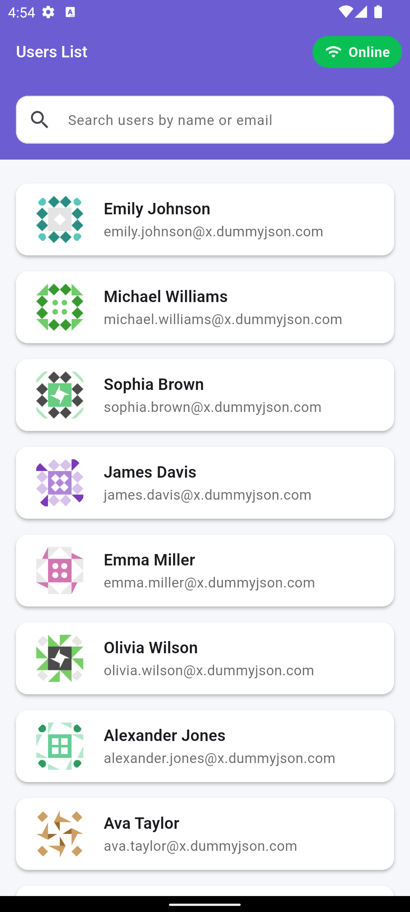
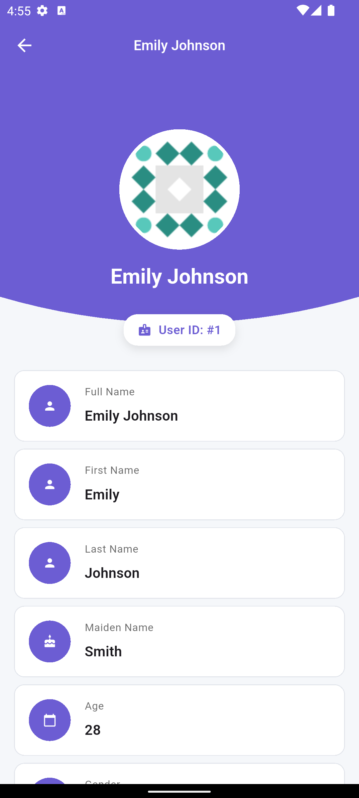
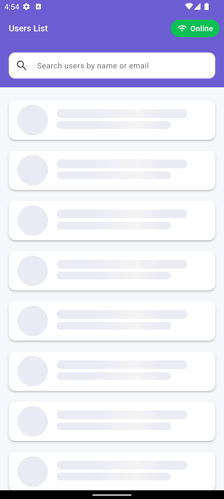
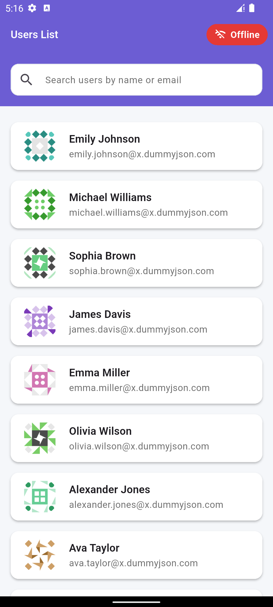
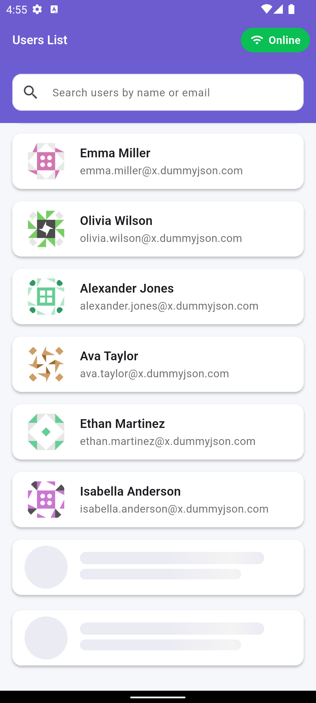
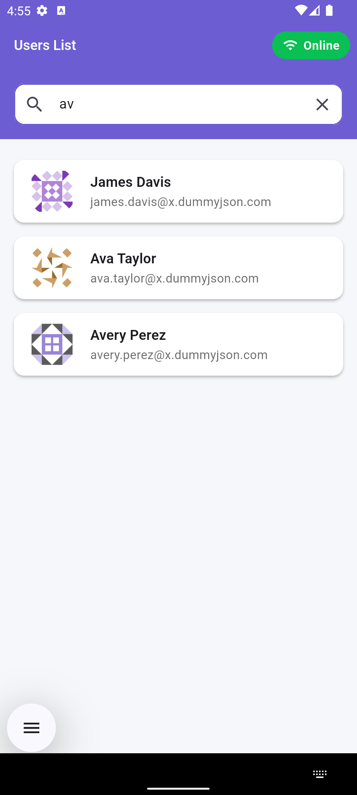
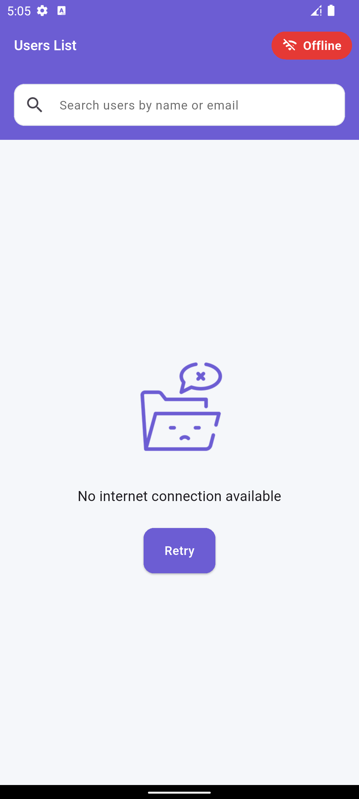
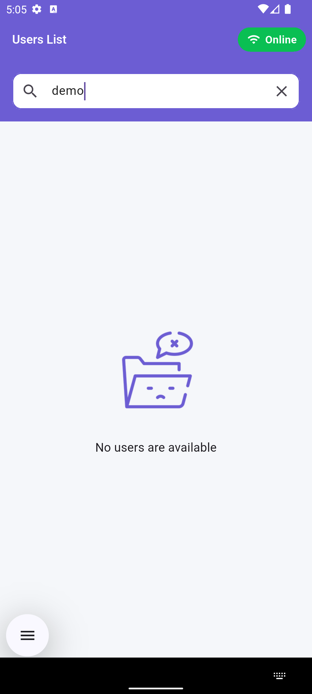

# Flutter Users Pagination Task

A Flutter application that demonstrates advanced concepts including pagination, caching, and clean architecture principles. The app fetches and displays user data with  error handling and comprehensive test coverage.

## 📱 Screenshots

| Screen 1 | Screen 2 | Screen 3 | Screen 4 |
|----------|----------|----------|----------|
|  |  |  | |

| Screen 5 | Screen 6 | Screen 7 | Screen 8 |
|----------|----------|----------|----------|
|  |  |  |  |


---

## 📥 Download APK

[](demo/apk/app-release.apk)

---

## 🎬 Demo Video
https://github.com/user-attachments/assets/700ea738-3551-437f-ae96-fd0c5692fdd3

## Features

### 1. Pagination
- Implements infinite scrolling with 10 items per page
- Pull-to-refresh functionality to reload data
- Smooth loading states with proper indicators

### 2. Local Caching
- Uses Hive for efficient local database caching
- Offline support with cached data display
- Automatic cache updates with new API data
- Visual offline mode indicator

### 3. State Management
- BLoC pattern implementation
- Clean Architecture principles
- Proper state handling:
  - Loading
  - Success
  - Empty
  - Error
- Clean and intuitive UI design

### 4. Error Handling
- 403 Unauthorized → Login Page redirection
- User-friendly error messages for other error codes

### 5. Testing Coverage
- Unit Tests: Repository and use case testing
- Widget Tests: UI component testing
- Integration Tests: API response simulation (403 redirect testing)
- Mock data implementation using mocktail

## API Used

The application uses [DummyJSON API](https://dummyjson.com) for fetching user data.
- Base endpoint: `https://dummyjson.com/users`
- Pagination support with limit and skip parameters
- Rich user data structure

## Project Structure

```
lib/
├── app/
│   ├── components/      # Reusable UI components
│   ├── core/           # Core functionality and utilities
│   ├── features/       # Feature-specific implementations
│   └── router/         # Navigation and routing
├── environment.dart    # Environment configuration
└── main.dart          # Application entry point
```

## Technical Implementation Notes

### Caching Strategy
- Initial data fetch from API
- Local storage using Hive database
- Offline mode with cached data access


### Architecture
- Clean Architecture implementation
- Separation of concerns:
  - Domain layer (entities, use cases)
  - Data layer (repositories, data sources)
  - Presentation layer (BLoC, UI)
- Dependency injection for better testability

### Dependencies
- `flutter_bloc`: State management
- `hive_ce_flutter`: Local database
- `dio`: Network requests
- `get_it`: Dependency injection
- `fpdart`: Functional programming utilities
- `mocktail`: Mocking for tests

## Getting Started

1. Clone the repository:
```bash
git clone https://github.com/ArmanKT/users_pagination_task.git
```

2. Install dependencies:
```bash
flutter pub get
```

3. Run the app:
```bash
flutter run
```

## Running Tests

Execute all tests:
```bash
flutter test
```


## Limitations and Future Improvements

- No dark mode support (planned for future)


## 👤 Author

- **ArmanKT**
  - GitHub: [@ArmanKT](https://github.com/ArmanKT)